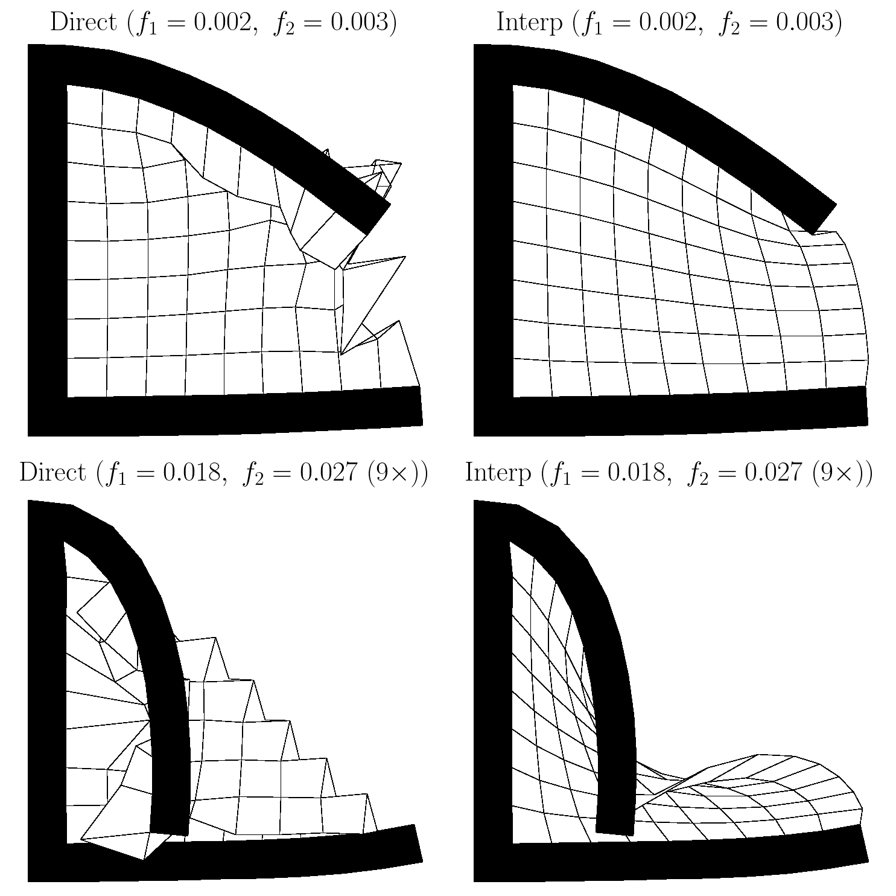
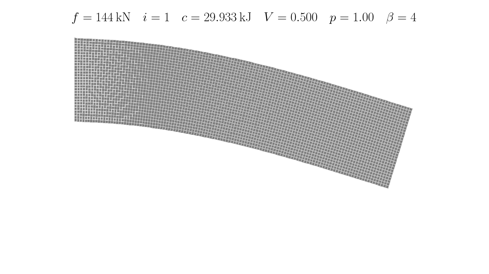
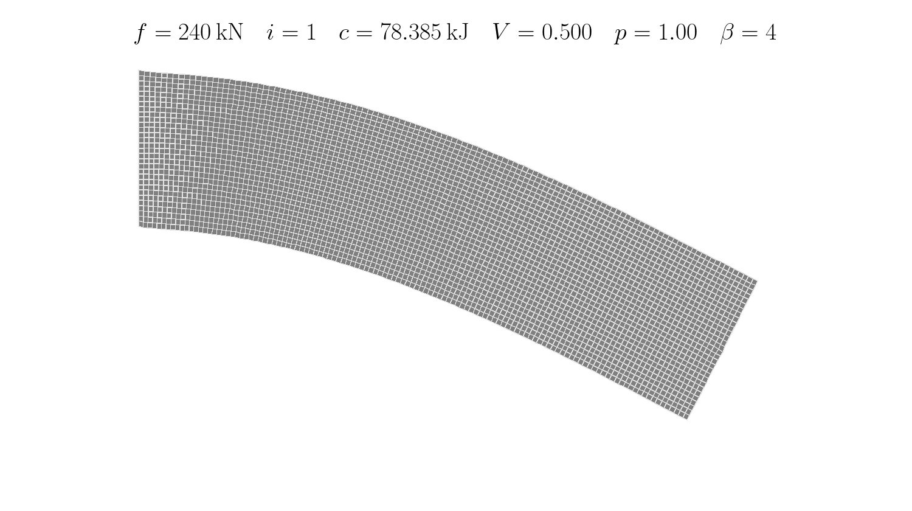
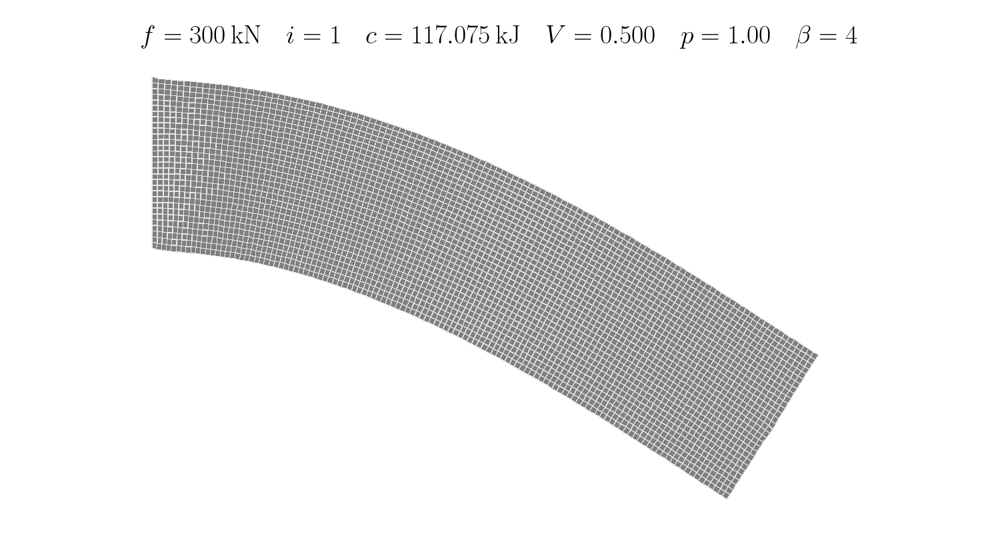
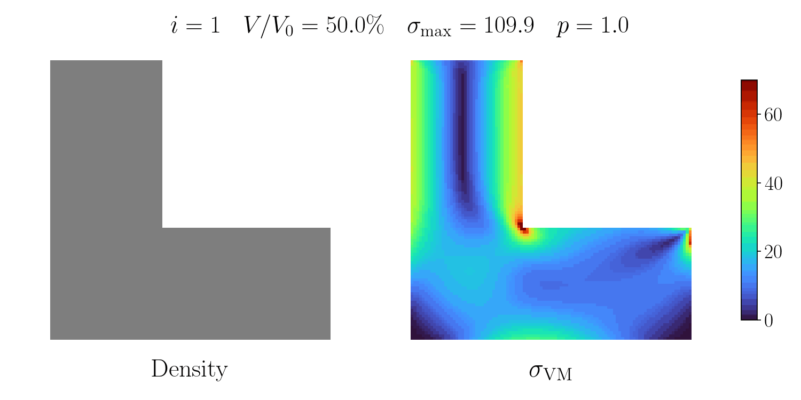
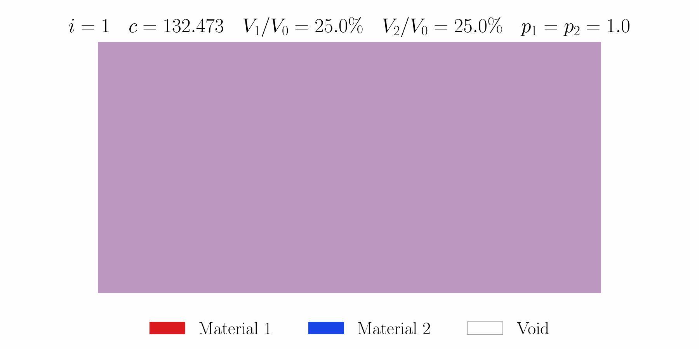
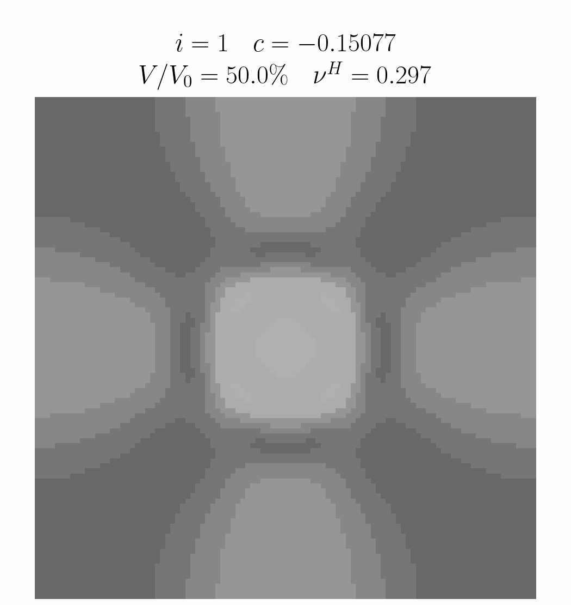
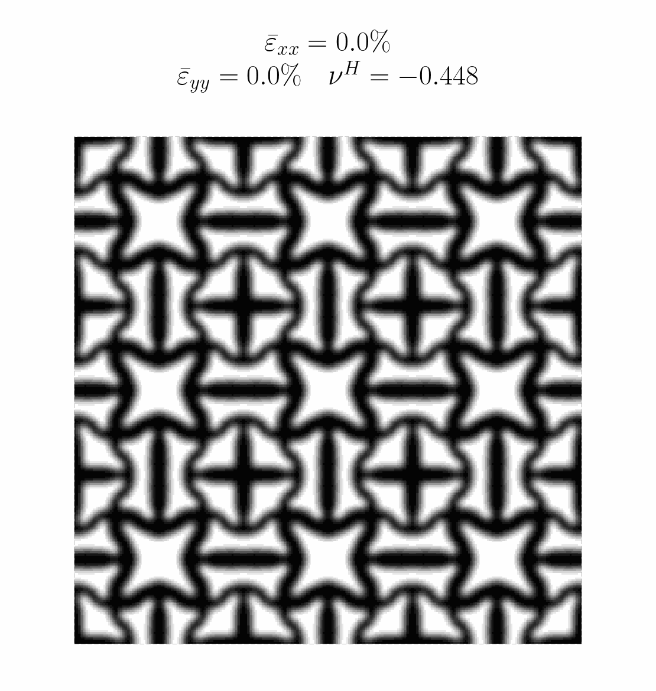

# topax
**Differentiable multidisciplinary topology optimization**

A gallery of topology optimization examples with differentiable finite element analysis implemented in [JAX](https://github.com/google/jax) and [JAX-FEM](https://github.com/deepmodeling/jax-fem).

## Gallery

### Minimum compliance

> Andreassen, Erik, et al. “Efficient topology optimization in MATLAB using 88 lines of code.” *Structural and Multidisciplinary Optimization* 43.1 (2011): 1–16.

| Example | Optimization history | MATLAB reference | Compliance |
| :---: | :---: | :---: | :---: |
| [`example_top88.ipynb`](example_top88.ipynb) |  | `top88(60,20,0.5,3,2.4,1)` | 216.8137 |
| [`example_top71.ipynb`](example_top71.ipynb) |  | `top71(60,20,0.5,3,2.4,2)` | 233.7146 |
| [`example_top82.ipynb`](example_top82.ipynb) |  | `top82(150,50,0.5,3,6,1)` | 217.8814 |
| [`example_top110.ipynb`](example_top110.ipynb) |  | `top110(60,20,0.5,3,1.8,3)` | 189.1405 |

### Heat conduction

> Bendsøe, M. P., and Sigmund, O. *Topology Optimization: Theory, Methods, and Applications*. Springer, 2004, Section 5.1.6.

| Example | Optimization history | MATLAB reference | Objective |
| :---: | :---: | :---: | :---: |
| [`example_topopt_heat.ipynb`](example_topopt_heat.ipynb) |  | `toph(40,40,0.4,3.0,1.2)` | 447.9944 |


### Compliant mechanism

> Bendsøe, M. P., and Sigmund, O. *Topology Optimization: Theory, Methods, and Applications*. Springer, 2004, Section 5.1.5.

| Example | Optimization history | MATLAB reference | Objective |
| :---: | :---: | :---: | :---: |
| [`example_topopt_mems.ipynb`](example_topopt_mems.ipynb) |  | `topm(40,20,0.3,3.0,1.2)` | -1.1131886 |


### Geometrical nonlinearity

> Wang, F., Lazarov, B. S., Sigmund, O., and Jensen, J. S. “Interpolation scheme for fictitious domain techniques and topology optimization of finite strain elastic problems.” *Computer Methods in Applied Mechanics and Engineering* 276 (2014): 453–472.

| C-shape fictitious-domain validation |
| :---: |
|  |

| Load | Deformed topology history | Reference | Result |
| :---: | :---: | :---: | :---: |
| 144 kN |  | 21.2747 kJ | 20.8721 kJ |
| 240 kN |  | 56.9401 kJ | 58.1354 kJ |
| 300 kN |  | 84.9415 kJ | 84.4505 kJ |


### Stress constraints

> Yang, D., Liu, H., Zhang, W., and Li, S. “Stress-constrained topology optimization based on maximum stress measures.” *Computers & Structures* 198 (2018): 23–39.

| Example | Optimization history | Reference | Result |
| :---: | :---: | :---: | :---: |
| [`example_topopt_stress.ipynb`](example_topopt_stress.ipynb) |  | $V/V_0=26.5\%$, $\sigma_{\max}=69.9$ | $V/V_0=26.36\%$, $\sigma_{\max}=69.999$ |

### Multiple material phases

> Bendsøe, M. P., and Sigmund, O. *Topology Optimization: Theory, Methods, and Applications*. Springer, 2004, Section 2.9.3.

| Example | Optimization history | Materials | Compliance |
| :---: | :---: | :---: | :---: |
| [`example_topopt_multimaterial.ipynb`](example_topopt_multimaterial.ipynb) |  | $E_1=1$, $E_2=0.2$, $V_1/V_0=V_2/V_0=25\%$ | 118.7094 |

### Negative Poisson's ratio

> Xia, L., and Breitkopf, P. “Design of materials using topology optimization and energy-based homogenization approach in Matlab.” *Structural and Multidisciplinary Optimization* 52 (2015): 1229–1241.

| Example | Optimization history | Uniaxial deformation | Reference | Result |
| :---: | :---: | :---: | :---: | :---: |
| [`example_topopt_auxetic.ipynb`](example_topopt_auxetic.ipynb) |  |  | $V/V_0=50\%$, $\nu^H=-0.448$ | $V/V_0=50\%$, $\nu^H=-0.4480$ |

## Citation

```bibtex
@software{xu2026topax,
  author = {Weipeng Xu and Tianju Xue},
  title = {topax: Topology optimization with differentiable finite element analysis},
  url = {https://github.com/xwpken/topax},
  year = {2026},
}
```
